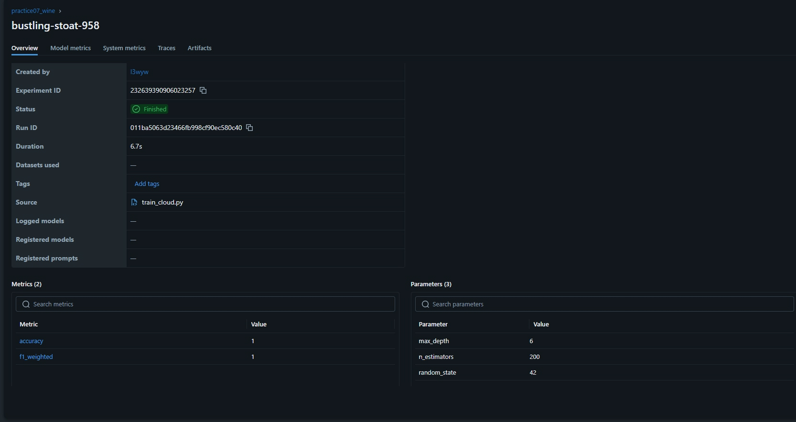
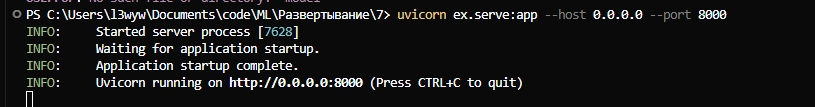
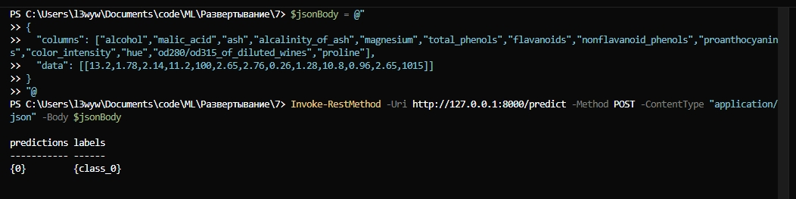
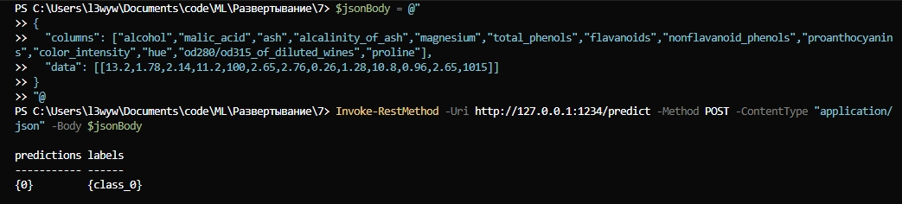

# Практика 7. Развёртывание модели через FastAPI и Docker

## Описание

Решение задачи классификации вин на 3 класса с использованием Random Forest, MLflow для логирования экспериментов, FastAPI для REST-сервиса и Docker для контейнеризации.

**Датасет:** Wine (13 признаков, 3 класса)
**Модель:** RandomForestClassifier
**Метрики:** accuracy, f1_weighted

## Структура проекта

```
ex/
├── train_cloud.py      # Обучение модели и сохранение в MLflow
├── serve.py           # FastAPI REST-сервис
├── requirements.txt   # Python зависимости
├── Dockerfile         # Конфигурация Docker
├── .dockerignore      # Исключения для Docker
├── README.md          # Эта инструкция
├── model/             # Артефакты модели (создается после обучения)
└── mlruns/            # Логи MLflow (создается после обучения)
```

## 1. Установка зависимостей

### Создание виртуального окружения

```powershell
# Переходим в папку ex
cd ex

# Создаем виртуальное окружение
python -m venv .venv

# Активируем окружение
.\.venv\Scripts\Activate.ps1

# Устанавливаем зависимости
pip install -r requirements.txt
```

## 2. Обучение модели

```powershell
# Запускаем обучение (из папки ex)
python train_cloud.py
```

**Что происходит:**

- Загружается датасет Wine из sklearn
- Обучается RandomForestClassifier с параметрами: n_estimators=200, max_depth=6
- Вычисляются метрики accuracy и f1_weighted
- Модель сохраняется в MLflow и копируется в папку `model/`
- Создается папка `mlruns/` с логами эксперимента

**Ожидаемый вывод:**

```
[OK] accuracy=0.9722 f1_weighted=0.9722
[OK] RUN_ID:        abc123...
[OK] TRACKING_URI:  file:///C:/.../ex/mlruns
[OK] REGISTRY_URI:  sqlite:///C:/.../ex/mlflow_registry.db
[OK] ARTIFACT_URI:  file:///C:/.../ex/mlruns/0/abc123.../artifacts
[OK] MODEL_URI:     runs:/abc123.../model
[OK] Local model →  C:\...\ex\model
```

## 3. Просмотр MLflow UI (опционально)

```powershell
# Запускаем MLflow UI
mlflow ui --backend-store-uri "file:///$((Resolve-Path mlruns).Path -replace '\\','/')" --host 127.0.0.1 --port 5000
```

Откройте http://127.0.0.1:5000 в браузере для просмотра экспериментов.

## 4. Локальный запуск REST-сервиса

```powershell
# Запускаем FastAPI сервис (из папки ex)
uvicorn serve:app --host 0.0.0.0 --port 8000
```

**Ожидаемый вывод:**

```
INFO:     Started server process [1234]
INFO:     Waiting for application startup.
INFO:     Application startup complete.
INFO:     Uvicorn running on http://0.0.0.0:8000 (Press CTRL+C to quit)
```

## 5. Тестирование локального сервиса

### Проверка доступности

```powershell
# Проверяем, что сервис работает
Invoke-RestMethod -Uri http://127.0.0.1:8000/ping
```

**Ожидаемый ответ:**

```json
{
  "status": "ok"
}
```

### Получение метаданных

```powershell
# Получаем информацию о модели
Invoke-RestMethod -Uri http://127.0.0.1:8000/metadata
```

### Предсказание (основной тест)

```powershell
$jsonBody = @"
{
  "columns": ["alcohol","malic_acid","ash","alcalinity_of_ash","magnesium","total_phenols","flavanoids","nonflavanoid_phenols","proanthocyanins","color_intensity","hue","od280/od315_of_diluted_wines","proline"],
  "data": [[13.2,1.78,2.14,11.2,100,2.65,2.76,0.26,1.28,10.8,0.96,2.65,1015]]
}
"@

# Отправляем запрос
Invoke-RestMethod -Uri http://127.0.0.1:8000/predict -Method POST -ContentType "application/json" -Body $body
```

**Ожидаемый ответ:**

```json
{
  "predictions": [0],
  "labels": ["class_0"]
}
```

## 6. Docker

### Проверка Docker

```powershell
# Проверяем, что Docker установлен и работает
docker --version
docker info
```

### Сборка образа

```powershell
# Собираем Docker образ (из папки ex)
docker build -t wine-model .
```

**Ожидаемый вывод:**

```
Sending build context to Docker daemon...
Step 1/6 : FROM python:3.10-slim
 ---> abc123...
Step 2/6 : WORKDIR /app
 ---> Running in def456...
...
Successfully built abc123...
Successfully tagged wine-model:latest
```

### Запуск контейнера

```powershell
# Запускаем контейнер
docker run --rm -p 1234:8000 wine-model
```

**Ожидаемый вывод:**

```
INFO:     Started server process [1]
INFO:     Waiting for application startup.
INFO:     Application startup complete.
INFO:     Uvicorn running on http://0.0.0.0:8000 (Press CTRL+C to quit)
```

### Тестирование Docker-контейнера

```powershell
# Используем тот же запрос, но на порт 1234
Invoke-RestMethod -Uri http://127.0.0.1:1234/predict -Method POST -ContentType "application/json" -Body $body
```

**Ожидаемый ответ:**

```json
{
  "predictions": [1],
  "labels": ["class_1"]
}
```

## 7. Полный пример тестирования

```powershell
# 1. Подготовка данных
$columns = @(
  "alcohol","malic_acid","ash","alcalinity_of_ash","magnesium",
  "total_phenols","flavanoids","nonflavanoid_phenols","proanthocyanins",
  "color_intensity","hue","od280/od315_of_diluted_wines","proline"
)

# 2. Несколько образцов для тестирования
$data = @(
  @(13.2,1.78,2.14,11.2,100,2.65,2.76,0.26,1.28,10.8,0.96,2.65,1015),
  @(12.8,3.27,2.58,22,106,1.65,0.6,0.36,0.8,3.0,0.39,1.16,500),
  @(13.4,3.91,2.48,23,102,1.8,0.75,0.43,1.4,7.3,0.7,1.56,750)
)

# 3. Формируем JSON
$body = @{
  columns = $columns
  data    = $data
} | ConvertTo-Json -Depth 5

# 4. Тестируем локальный сервис
Write-Host "Testing local service..."
Invoke-RestMethod -Uri http://127.0.0.1:8000/predict -Method POST -ContentType "application/json" -Body $body

# 5. Тестируем Docker контейнер
Write-Host "Testing Docker container..."
Invoke-RestMethod -Uri http://127.0.0.1:1234/predict -Method POST -ContentType "application/json" -Body $body
```

## 8. Что сдавать

### Скриншоты:

1. **MLflow UI**
   
2. **Работающий Uvicorn** - терминал с запущенным сервисом
   
3. **Успешный запрос локально** - результат `Invoke-RestMethod` на порт 8000
   
4. **Успешный запрос в Docker** - результат `Invoke-RestMethod` на порт 1234
   

### Файлы проекта:

- `train_cloud.py`
- `serve.py`
- `requirements.txt`
- `Dockerfile`
- `.dockerignore`
- `README.md`

### Краткий отчёт:

- **Датасет:** Wine (13 признаков, 3 класса)
- **Задача:** Многоклассовая классификация
- **Модель:** RandomForestClassifier
- **Метрики:** accuracy и f1_weighted (значения из вывода обучения)
